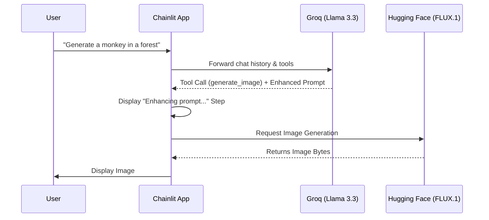

# 🎬 AI Image Generator Chatbot


A lightning-fast, conversational AI agent that generates highly detailed images. The app uses **Groq** to intelligently understand your request and enhance your prompt, and **Hugging Face (FLUX.1-schnell)** to generate stunning, photorealistic images instantly.

---

## 🌐 Live Demo & Media

- **Demo Video:** [Watch on Loom](https://www.loom.com/share/f88a7d443ebe4040949c01b06aea11e2)


---

## 📸 Screenshots

### AI Chat Interface
 

### Generated Image Examples

| Beautiful Scenery | A Porsche | A Futuristic Bugatti |
| :---: | :---: | :---: |
|  |  |  |

---

## ✨ Key Features

- **🗣️ Conversational AI:** Chat naturally with the Llama 3.3 model via Groq's blazing-fast inference.
- **🪄 Auto-Prompt Enhancement:** When you ask for an image, Groq acts as a prompt engineer and automatically enhances your idea into a highly descriptive, visually stunning prompt.
- **🎨 High-Quality Image Generation:** Uses the state-of-the-art FLUX.1-schnell model via Hugging Face to generate the actual image.
- **⚡ Synchronous Background Threads:** Bypasses common Windows `asyncio` networking bugs using `asyncio.to_thread` for rock-solid stability.
- **🗂️ Clean UI Workflow:** Utilizes Chainlit's expandable Steps UI to clearly show the prompt enhancement process.

---

## 🛠️ Tech Stack Table

| Technology | Category | Purpose |
| :--- | :--- | :--- |
| **Chainlit** | Frontend / App Framework | Chat UI, state management, and conversational interface. |
| **Groq (Llama 3.3 70B)** | LLM / Text Generation | Conversational engine and prompt enhancement via function calling. |
| **Hugging Face API** | Model Inference | Serves the `black-forest-labs/FLUX.1-schnell` image generation model. |
| **huggingface_hub** | SDK | Official Python SDK to cleanly route HF inference API calls. |

---

## ⚙️ How It Works

1. **User Request:** The user types a message or asks for an image in the Chainlit UI.
2. **Groq Analysis:** The message is sent to Groq. If the user wants an image, Groq triggers the `generate_image` function call and rewrites the prompt to make it incredibly detailed.
3. **Chainlit Step:** The UI displays an expandable "Enhancing prompt & generating image..." step so the user can see the enhanced prompt.
4. **Hugging Face Generation:** A background thread connects to the Hugging Face `InferenceClient` to generate the image using FLUX.1.
5. **Final Output:** The generated bytes are converted to a `cl.Image` and displayed in the chat alongside a concluding message from Groq.

---

## 🏗️ Project Architecture



---

## 📂 Project Structure

```text
📦 Image-Generator-Chainlit-App
 ┣ 📂 .chainlit         # Chainlit configuration files
 ┣ 📂 venv              # Python virtual environment (ignored in git)
 ┣ 📜 app.py            # Main application logic and routing
 ┣ 📜 chainlit.md       # Welcome screen markdown
 ┣ 📜 .env              # Environment variables (API Keys)
 ┗ 📜 requirements.txt  # Python dependencies
```

---

## 💻 Local Setup & Installation

**1. Clone the repository**
```bash
git clone https://github.com/Arslan-Codes097/Image-Generator-Chainlit-App-.git
cd Image-Generator-Chainlit-App-
```

**2. Create and activate a Virtual Environment**
```bash
python -m venv venv
# On Windows:
.\venv\Scripts\activate
# On Mac/Linux:
source venv/bin/activate
```

**3. Install Dependencies**
```bash
pip install -r requirements.txt
```

**4. Set up Environment Variables**
Create a `.env` file in the root directory and add your API keys:
```env
GROQ_API_KEY=your_groq_api_key_here
HF_API_KEY=your_huggingface_api_key_here
```

**5. Run the Application**
```bash
chainlit run app.py -w
```

---

## 👤 Author & Credits

**Developed by [@Arslan-Codes097](https://github.com/Arslan-Codes097)**  
*Built project using Chainlit, Groq, and Hugging Face.*
